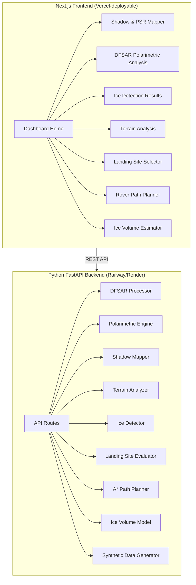

# ISRO BAH 2026 — Problem Statement 8: Lunar Subsurface Ice Detection & Rover Planning

## Problem Summary
Build a complete deployable solution for **detection and characterization of subsurface ice** in lunar south polar regions using Chandrayaan-2 DFSAR/OHRC data, including **landing site selection** and **rover traverse planning**.

## Architecture

## Key Scientific Modules

### 1. DFSAR Polarimetric Analysis
- Compute **Stokes Parameters** (S₀, S₁, S₂, S₃) from scattering matrix
- Derive **Circular Polarization Ratio (CPR)** = P_SC / P_OC
- Derive **Degree of Polarization (DOP)** = √(S₁² + S₂² + S₃²) / S₀
- Apply ice criteria: **CPR > 1** AND **DOP < 0.13**

### 2. Shadow Mapping & PSR Identification
- Illumination modeling using DEM + solar angles
- Identify **Permanently Shadowed Regions (PSRs)**
- Detect **doubly shadowed craters** within PSRs (craters within craters)

### 3. Terrain Analysis (from DEM/OHRC)
- Slope computation (gradient analysis)
- Surface roughness estimation
- Boulder density mapping
- Crater morphology analysis (lobate-rim detection)

### 4. Ice Detection & Characterization
- Combined CPR + DOP thresholding
- Spatial clustering of ice signatures
- Confidence scoring per pixel/region
- Cross-referencing with shadow map

### 5. Landing Site Selection
Multi-criteria evaluation:
- Slope ≤ 15° (safe landing)
- Proximity to ice-bearing doubly shadowed craters
- Solar illumination availability (power)
- Communication line-of-sight
- Surface roughness below threshold
- Weighted scoring → ranked candidate sites

### 6. Rover Traverse Path Planning
- **A\* algorithm** with custom cost function:
  - Terrain slope penalty
  - Roughness penalty
  - Shadow/illumination factor (solar power)
  - Hazard avoidance (craters, boulders)
- Generates optimal path from landing site to target doubly shadowed crater
- Path safety metrics and energy estimates

### 7. Ice Volume Estimation
- **Dielectric mixing model**: ε_eff = f·ε_ice + (1-f)·ε_regolith
- Invert radar backscatter to estimate ice fraction `f`
- Integrate over area × depth (~5m) for volume estimates
- Monte Carlo uncertainty quantification

## Proposed Changes

### Backend (Python FastAPI)

#### [NEW] [backend/](file:///c:/Users/hp/Desktop/ISRO/backend/)
Complete Python FastAPI backend with scientific processing modules:

| File | Purpose |
|------|---------|
| `app.py` | FastAPI main app with all API routes |
| `requirements.txt` | Dependencies (numpy, scipy, fastapi, etc.) |
| `modules/__init__.py` | Package init |
| `modules/dfsar_processor.py` | DFSAR data I/O, preprocessing, calibration |
| `modules/polarimetric.py` | Stokes parameters, CPR, DOP computation |
| `modules/shadow_mapping.py` | PSR detection, illumination modeling |
| `modules/terrain_analysis.py` | DEM processing, slopes, roughness |
| `modules/ice_detection.py` | Ice signature detection with CPR+DOP criteria |
| `modules/landing_site.py` | Multi-criteria landing site evaluation |
| `modules/path_planning.py` | A* rover traverse planner |
| `modules/ice_volume.py` | Dielectric model, ice volume estimation |
| `modules/data_generator.py` | Realistic synthetic data for demo |

---

### Frontend (Next.js)

#### [NEW] [frontend/](file:///c:/Users/hp/Desktop/ISRO/frontend/)
Next.js 14 app with App Router, featuring a stunning interactive dashboard:

| Component | Purpose |
|-----------|---------|
| `app/page.tsx` | Main dashboard with overview cards |
| `app/layout.tsx` | Root layout with navigation |
| `app/globals.css` | Design system with dark space theme |
| `app/shadow-mapping/page.tsx` | PSR & shadow visualization |
| `app/polarimetric/page.tsx` | CPR/DOP analysis & heatmaps |
| `app/ice-detection/page.tsx` | Ice detection results |
| `app/terrain/page.tsx` | Terrain analysis & 3D views |
| `app/landing-site/page.tsx` | Landing site evaluation & ranking |
| `app/path-planning/page.tsx` | Rover traverse visualization |
| `app/ice-volume/page.tsx` | Volume estimation & charts |
| `components/` | Reusable UI components |

---

### Deployment & Documentation

#### [NEW] [Dockerfile](file:///c:/Users/hp/Desktop/ISRO/Dockerfile)
#### [NEW] [docker-compose.yml](file:///c:/Users/hp/Desktop/ISRO/docker-compose.yml)
#### [NEW] [README.md](file:///c:/Users/hp/Desktop/ISRO/README.md)

## Design Aesthetic
- **Dark space theme** — deep navy/black backgrounds with glowing cyan/purple accents
- **Glassmorphism** cards for data panels
- **Animated heatmaps** for CPR/DOP visualization
- **Interactive maps** with Leaflet.js for lunar surface
- **3D terrain** rendering
- **Smooth transitions** between pages
- Google Font: **Inter** for clean typography

## Innovation Highlights (Hackathon Differentiators)
1. **Full-stack web platform** — not just scripts, a deployable decision-support tool
2. **AI-enhanced A\* path planning** with multi-objective cost functions
3. **Monte Carlo ice volume estimation** with uncertainty quantification
4. **Real-time interactive dashboard** with stunning visualizations
5. **Modular architecture** — easy to plug in real DFSAR data during hackathon

## Verification Plan

### Automated Tests
- `python -m pytest backend/tests/` — unit tests for all scientific modules
- `npm run build` — verify Next.js builds without errors

### Manual Verification
- Launch both servers, verify all dashboard pages render
- Test API endpoints with synthetic data
- Verify scientific outputs match expected values (CPR/DOP ranges)

## Open Questions

> [!IMPORTANT]
> The hackathon will supply actual DFSAR data. The system is built with synthetic data for now but is designed to accept real data with minimal changes (just swap data files).

> [!NOTE]
> Since SLDEM2015 only covers ±60° latitude, for the south pole we use LOLA polar DEMs. The synthetic data generator creates realistic polar DEM data for demonstration.
